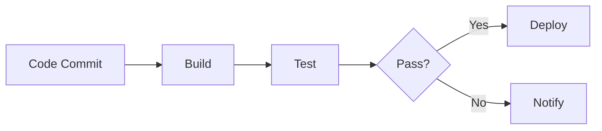

# Final Summary: Simplified Unified Smart Interface

## 🎯 What We're Building

A **single, intelligent interface** that automatically detects whether the user wants:
- 💻 **Code generation** (existing functionality)
- 🎨 **Workflow diagrams** (new feature)
- 📊 **PPT enhancement** (new feature)

**No separate tabs needed!** The backend is smart enough to figure it out.

---

## 📊 Design Philosophy

### Before (Complex)
```
User → Choose Tab → Enter Prompt → Generate
       ↓
   5 different tabs
   User must know which to use
   More UI clutter
```

### After (Simple)
```
User → Enter Prompt → Generate
       ↓
   System auto-detects intent
   Same familiar interface
   Smart backend routing
```

---

## 🎨 UI Changes (Minimal!)

### Only 2 Small Additions to Existing "Generate Code" Tab:

1. **Mode Selector** (optional dropdown)
   ```
   Mode: [🤖 Auto-detect (Recommended) ▼]
         [💻 Code Generation]
         [🎨 Workflow Diagram]
         [📊 PPT Enhancement]
   ```

2. **Updated Placeholder Text**
   ```
   "Examples: 'Write a Python function...' OR 
    'Create a CI/CD pipeline diagram' OR 
    'Enhance my presentation slide...'"
   ```

**That's it!** Everything else stays the same.

---

## 🧠 Smart Detection Examples

| User Input | Auto-Detected As | Confidence |
|------------|------------------|------------|
| "Write a Python function to reverse a string" | Code | 95% |
| "Create a CI/CD pipeline diagram" | Workflow | 92% |
| "Generate a flowchart for user authentication" | Workflow | 95% |
| "Enhance my presentation slide about AI" | PPT | 88% |
| "Make my slide more visual with infographics" | PPT | 90% |
| "Implement binary search in JavaScript" | Code | 95% |
| "Show me a sequence diagram for order processing" | Workflow | 93% |

---

## 🔧 Implementation Files

### New Backend Files (3 files)
1. **`src/smart_detector.py`** (~100 lines)
   - Keyword-based detection
   - Pattern matching
   - Confidence scoring

2. **`src/workflow_generator.py`** (~150 lines)
   - Text-to-Mermaid conversion
   - Diagram rendering
   - Export functionality

3. **`src/ppt_enhancer.py`** (~200 lines)
   - Multi-option generation
   - Design variations
   - Enhancement logic

### Modified Files (2 files)
1. **`src/api_server.py`**
   - Add `/generate/smart` endpoint
   - Route to appropriate handler
   - Return type-specific responses

2. **`frontend/app.js`**
   - Update generate function
   - Add result display logic
   - Handle different output types

### HTML Changes (1 file)
1. **`frontend/index.html`**
   - Add mode selector dropdown
   - Add Mermaid.js script
   - Update placeholder text

**Total: 6 files (3 new, 3 modified)**

---

## 📦 Dependencies

### Python (Backend)
```bash
# Already have: requests, fastapi, pydantic
# No new dependencies needed for MVP!
# (Optional later: python-pptx, Pillow for advanced features)
```

### JavaScript (Frontend)
```html
<!-- Add to index.html -->
<script src="https://cdn.jsdelivr.net/npm/mermaid@10/dist/mermaid.min.js"></script>
```

### LLM Models
```bash
# Use existing models for MVP
# Optional: Add specialized models later
ollama pull llama3.2:3b  # Good for workflows
```

---

## 🚀 MVP Implementation (Week 1-2)

### Phase 1: Smart Detection (Day 1-2)
- [ ] Create `smart_detector.py`
- [ ] Add keyword detection
- [ ] Test with various prompts
- [ ] Tune confidence thresholds

### Phase 2: Workflow Generation (Day 3-5)
- [ ] Create `workflow_generator.py`
- [ ] Implement text-to-Mermaid conversion
- [ ] Add Mermaid.js to frontend
- [ ] Test diagram rendering

### Phase 3: API Integration (Day 6-7)
- [ ] Add `/generate/smart` endpoint
- [ ] Implement routing logic
- [ ] Test all three modes

### Phase 4: Frontend Updates (Day 8-9)
- [ ] Add mode selector to HTML
- [ ] Update JavaScript handlers
- [ ] Add result display logic
- [ ] Test user interactions

### Phase 5: PPT Enhancement (Day 10-12)
- [ ] Create `ppt_enhancer.py`
- [ ] Implement option generation
- [ ] Add frontend display
- [ ] Test multi-option selection

### Phase 6: Testing & Polish (Day 13-14)
- [ ] End-to-end testing
- [ ] Fix bugs
- [ ] Improve detection accuracy
- [ ] Add error handling

---

## 💡 Example User Flows

### Flow 1: Code Generation (Existing + Enhanced)
```
1. User enters: "Write a Python function to reverse a string"
2. Mode: Auto-detect
3. System detects: Code (95% confidence)
4. Output: Syntax-highlighted Python code
5. User can copy/download as before
```

### Flow 2: Workflow Diagram (New)
```
1. User enters: "Create a CI/CD pipeline diagram"
2. Mode: Auto-detect
3. System detects: Workflow (92% confidence)
4. Output: Interactive Mermaid diagram
5. User can export as SVG/PNG/PDF
```

### Flow 3: PPT Enhancement (New)
```
1. User enters: "Enhance my presentation slide about AI"
2. Mode: Auto-detect
3. System detects: PPT (88% confidence)
4. Output: 3 design options to choose from
5. User selects option(s) and applies
```

### Flow 4: Manual Override
```
1. User enters: "pipeline" (ambiguous)
2. User selects: Workflow (manual override)
3. System uses: Workflow (100% confidence)
4. Output: Workflow diagram
```

---

## 🎨 Output Examples

### Code Output (Existing)
```python
def reverse_string(s: str) -> str:
    """Reverse a string using Python slicing."""
    return s[::-1]
```

### Workflow Output (New)


### PPT Output (New)
```
Option 1: Modern Design
- Bold colors
- Clean layout
- Modern typography

Option 2: Infographic Style
- Data visualization
- Icons and diagrams
- Visual hierarchy

Option 3: Professional
- Corporate colors
- Structured layout
- Business-ready
```

---

## ✅ Success Criteria

### MVP Success Metrics
- ✅ 90%+ detection accuracy
- ✅ < 5 second response time
- ✅ Works with existing models
- ✅ No breaking changes to existing features
- ✅ Intuitive user experience

### User Experience Goals
- ✅ Zero learning curve (uses existing UI)
- ✅ Works without mode selection
- ✅ Clear confidence indicators
- ✅ Easy to override auto-detection
- ✅ Consistent with existing design

---

## 🔮 Future Enhancements (Post-MVP)

### Phase 2 Features
- File upload for PPT enhancement
- More diagram types (GraphViz, PlantUML)
- Advanced PPT editing
- Template library
- Batch processing

### Phase 3 Features
- Multi-modal input (text + images)
- Collaborative editing
- Version history
- Custom templates
- API for external integrations

---

## 📁 Project Structure

```
my_llm/
├── src/
│   ├── api_server.py           # MODIFIED - Add smart endpoint
│   ├── smart_detector.py       # NEW - Intent detection
│   ├── workflow_generator.py   # NEW - Diagram generation
│   ├── ppt_enhancer.py         # NEW - PPT options
│   ├── llm_client.py           # UNCHANGED
│   ├── database.py             # UNCHANGED
│   └── ...
├── frontend/
│   ├── index.html              # MODIFIED - Add mode selector
│   ├── app.js                  # MODIFIED - Add smart logic
│   ├── styles.css              # UNCHANGED (maybe minor tweaks)
│   └── ...
├── SIMPLIFIED_DESIGN.md        # This design doc
├── QUICK_START_GUIDE.md        # Implementation guide
├── simple_mockup.html          # Interactive mockup
└── ...
```

---

## 🎯 Key Takeaways

1. **Simplicity wins** - One interface is better than multiple tabs
2. **Smart defaults** - Auto-detection removes decision burden
3. **User control** - Manual override when needed
4. **Progressive enhancement** - Existing features still work
5. **Minimal changes** - Reuse existing UI components

---

## 🚀 Ready to Start?

### Recommended Approach:
1. **Review the mockup** (already open in your browser)
2. **Read QUICK_START_GUIDE.md** for step-by-step implementation
3. **Start with Phase 1** (Smart Detection)
4. **Test incrementally** after each phase
5. **Iterate based on feedback**

### First Steps:
```bash
# 1. Create smart detector
touch src/smart_detector.py

# 2. Test detection logic
python -c "from src.smart_detector import SmartDetector; \
           print(SmartDetector.detect_intent('Create a CI/CD pipeline'))"

# 3. Add to API server
# Edit src/api_server.py

# 4. Update frontend
# Edit frontend/index.html and frontend/app.js

# 5. Test in browser
# Visit http://localhost:8080
```

---

## 📊 Comparison: Original vs Simplified

| Aspect | Original Design | Simplified Design |
|--------|----------------|-------------------|
| **Tabs** | 5 tabs (3 existing + 2 new) | 3 tabs (existing only) |
| **User Decision** | Choose correct tab | Just enter prompt |
| **Learning Curve** | Must learn new tabs | Zero (uses existing UI) |
| **Code Changes** | Major (new tabs, routes) | Minimal (enhance existing) |
| **Complexity** | High | Low |
| **Flexibility** | Separate workflows | Unified workflow |
| **Maintenance** | More code to maintain | Less code to maintain |

---

## 💬 Questions?

**Q: What if detection is wrong?**
A: User can manually select mode from dropdown.

**Q: Does this break existing functionality?**
A: No! Existing code generation works exactly the same.

**Q: Can we add more modes later?**
A: Yes! Just add to the detector and routing logic.

**Q: What about file uploads for PPT?**
A: Can add later. MVP uses text prompts only.

**Q: Performance impact?**
A: Minimal - detection is fast keyword matching.

---

**The simplified design is ready to implement! Check out the interactive mockup in your browser.** 🚀

